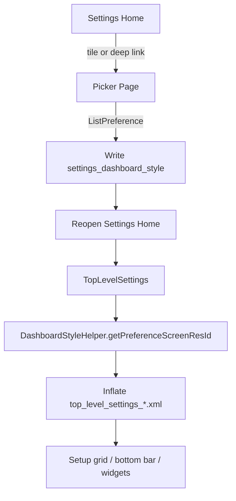

# Custom Dashboard overview

## What it does

The Custom Dashboard system lets users (or admins) pick which **Settings homepage layout** is shown when opening the Settings app. The active choice is stored in:

```
Settings.System → settings_dashboard_style  (int)
```

Default style: **7** (BMobile Home).

## Architecture

```
User picks style in picker fragment
        ↓
DashboardSystemKeys.putDashboardStyle()
        ↓
CustomDashboardLauncher.reopenSettingsHome()
        ↓
TopLevelSettings loads XML from DashboardStyleHelper
        ↓
Style-specific grid/bottom-bar setup runs in onViewCreated()
```

### Key classes

| Class | Role |
|-------|------|
| `DashboardStyleHelper` | Maps style ID → `top_level_settings_*.xml` |
| `DashboardSystemKeys` | Read/write `settings_dashboard_style` |
| `TopLevelSettings` | Homepage fragment; wires grids, bottom bars, widgets |
| `BrandDashboardSettings` | Base class for all picker pages |
| `CustomDashboardSettings` | Full style list |
| `YrCustomDashboardSettings` | YR-filtered list |
| `BMobileDashboardSettings` | BMobile-filtered list |
| `KidsSafeDashboardSettings` | KidsSafe-filtered list (no bottom bar) |
| `CustomDashboardLauncher` | Open picker, reopen home, broadcast on change |
| `SystemUiRestarter` | Restart SystemUI from picker bottom bar |

### Key resources

| Resource | Role |
|----------|------|
| `res/xml/top_level_settings_*.xml` | Homepage layout definitions |
| `res/xml/custom_dashboard_settings.xml` | Full picker preferences |
| `res/xml/*_dashboard_settings.xml` | Brand picker preferences |
| `res/values/system_basic_strings.xml` | Picker + style labels |
| `res/values/arrays.xml` | Style list entries per picker |

## Flow diagram


